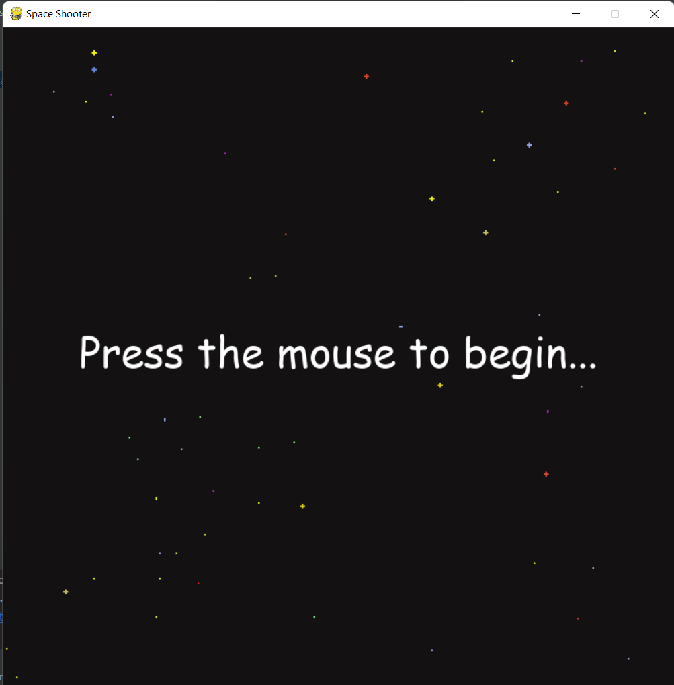
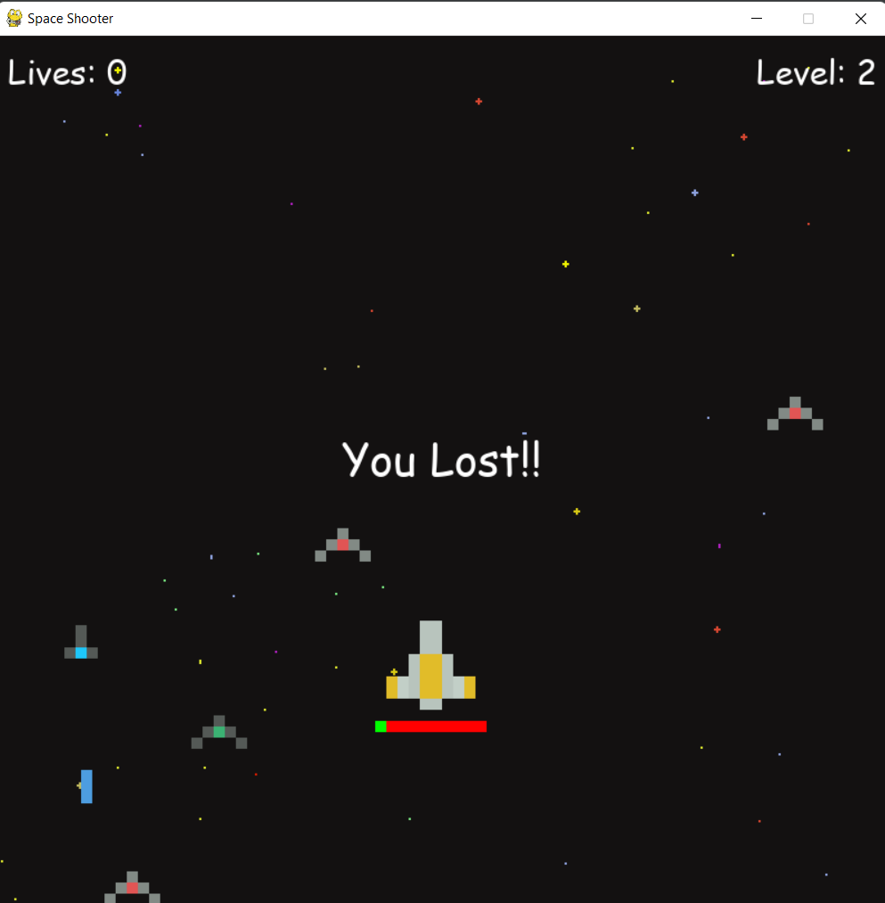

# Space Invader Game
A game based on Space Invaders for players to battle enemy ships using the **pygame module** in **Python**.

## How To Play
* Use the keys A, D, W, S for left, right, up, and down, respectively
* Use the space bar to shoot bullets at enemy spaceships
* The green bar below the player ship indicates health status

## Pygame GUI

### Credits for images
<a href="">Background and spaceships from XXX</a>
